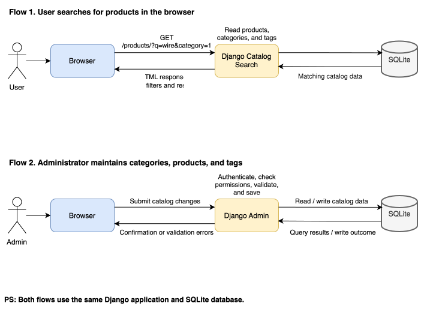
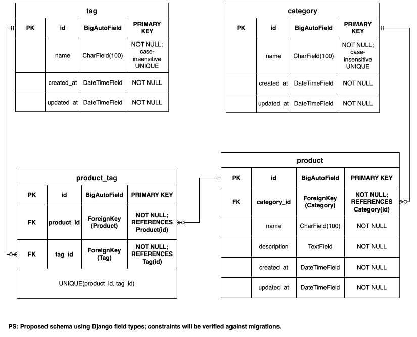

# Catalog System Design

A small, locally reviewed catalog: public product search, maintenance through
Django admin, and SQLite storage. Commerce features and production deployment
are outside scope.

[Setup](../README.md) · [Tests and verification](testing.md)

## Assignment coverage

| Requirement | Implementation |
| --- | --- |
| Product, category and tag relationships | One required category per product; zero or more tags through a many-to-many relationship. |
| Admin-entered sample data: ≥5 categories, ≥10 tags, ≥20 products | 5 categories, 12 tags and 20 products entered through admin, then exported as a fixture. |
| Search by description | Case-insensitive, description-only keyword matching. |
| Filter by category and tags; combine filters | Description AND category AND tag predicate; tags support All or Any. |
| HTML interface | Django templates with a GET form, results and pagination. |

The choices below define behavior the assignment left open.

## Architecture

One `catalog` app owns the domain and migrations. Internal packages separate responsibilities:

| Location | Responsibility |
| --- | --- |
| [`catalog/models/`](../catalog/models/) | Relationships, field validation and constraints |
| [`search/forms.py`](../catalog/search/forms.py) | Input validation and normalization |
| [`search/queries.py`](../catalog/search/queries.py) | Search predicates and relationship loading |
| [`search/views.py`](../catalog/search/views.py) | Form handling, pagination and HTTP responses |
| [`admin.py`](../catalog/admin.py) | Catalog maintenance |

This keeps the view small and query behavior testable without HTTP requests.
A plain query function is sufficient for this feature.

Public searches and authenticated admin changes use the same application and database.

## Data model

- **One category per product:** simple primary classification; tags provide overlapping attributes. Multiple categories per product are unsupported.
- **Optional tags:** Django's generated junction table enforces unique product–tag pairs.
- **Shared names:** trimming and `Lower(name)` uniqueness prevent duplicate category/tag labels such as `Indoor` and `indoor` while preserving display capitalization.
- **Validation:** model field cleaning enforces non-blank values and length limits, including a 2,000-character description limit. `NOT NULL` alone does not enforce these rules.
- **Deletion:** Django protects categories that still contain products and handles junction cleanup.

The ERD uses conceptual names and Django field types. SQLite tables are
`catalog_category`, `catalog_product`, `catalog_tag` and `catalog_product_tags`.
Deletion behavior describes Django handling, not database-level `ON DELETE` rules.
[Editable diagrams](catalog-design.drawio).

## Search behavior

### Matching and queries

Filters combine with AND. Within selected tags, **All** requires every tag;
**Any** accepts at least one. Both modes support useful search intentions at the
cost of extra query and test cases.

| Filter | Query behavior |
| --- | --- |
| Description | `description__icontains`; product names are not searched |
| Category | Exact category match |
| Any tags | `tags__in` plus `distinct()` to remove join duplicates |
| All tags | One chained filter per selected tag |
| No tags | No tag restriction |

`select_related("category")` and `prefetch_related("tags")` load display
relationships to avoid per-product queries. Admin also loads relationships eagerly.
The [admin regression test](../catalog/tests/test_admin.py) compares query counts
for one and two products; public listing query counts are not regression-tested.

### Results and navigation

- Explicit GET submission with Search or Enter; URLs can be shared or bookmarked.
- Default tag mode: All. Missing or empty mode also selects All.
- Each product appears once, ordered by name then ID, with 10 results per page.
- Results show name, full description, category, all tags, total count and an empty state.
- Pagination preserves filters and replaces only `page`; a new search resets to page 1.
- Clear removes all filters.

### Validation and page handling

Invalid filters return **HTTP 400**, form errors and no products. This avoids
silently broadening or changing a search. Users can correct the form or use Clear.

| Input | Rule |
| --- | --- |
| `q` | Trimmed; maximum 200 characters |
| Category/tag IDs | Positive ASCII digits; leading zeros accepted; malformed or unavailable IDs rejected |
| `tag_mode` | All or Any; invalid modes rejected |
| Repeated parameters | Duplicate `q`, `category`, `tag_mode` or `page` rejected; repeated tags deduplicated |
| Unknown parameters | Ignored |
| Missing/non-numeric `page` | First page via `Paginator.get_page()` |
| Zero, negative or too-large `page` | Last page via `Paginator.get_page()`; no redirect |

Known UI limitation: a leading-zero ID can validate while its bound widget does
not visually select the normalized option.

## Technical choices and quality checks

These are implementation choices for a small local catalog, not additional
assignment requirements.

| Choice | Reason and boundary |
| --- | --- |
| Django templates and GET requests | Shareable searches without client-side request/history management; no application JavaScript. |
| SQLite | Simple local setup without a database service; no concurrency or capacity target. |
| uv, lockfiles and Docker | Repeatable dependencies; Docker also builds CSS. A named volume preserves SQLite across normal container recreation. |
| Compiled Tailwind CSS | Shared theme tokens, Preflight and named CSS classes without a frontend application runtime. |
| Django admin access | Only users with the required admin permissions can maintain catalog data. |
| Safe description display | Django escapes HTML in descriptions so it displays as text; `linebreaksbr` preserves line breaks. |
| Labels, focus indicators and responsive CSS | Basic usability; desktop interactions checked, no formal accessibility audit. |
| Tests, Ruff and PR CI | Repeatable checks for behavior, migrations, formatting, CSS, Compose and Docker builds. |

The **67 automated tests** cover models/admin, forms and querysets. Public views
and pagination have manual checks only. Admin authentication and text escaping
use Django mechanisms without dedicated regression tests. Windows setup is untested.
See [testing notes](testing.md) for demo cases, verification records and Docker
persistence checks.
